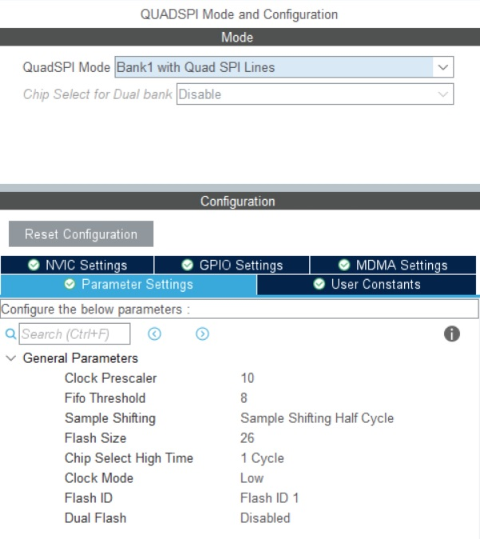

# W25N01 128MB Flash Library
### STM32 C library communicating via QSPI Interface
**This Library is tested on stm32H7 series.**

W25N01 is the bigger chip from W25Qxx family. It consists of 1 Gbits or 128 MBytes of memory and its pinout is compatible with the W25Qxx series.
It can communicate over normal, dual or quad SPI interface. In this library, for the maximum of throughput I implemented the entire library via quad SPI protocol and used STM32H series QSPI peripheral.
I recommend configuring the microcontroller using STM32CubeMX software. The QSPI structure is used as an external variable in the .c file.
```C
extern QSPI_HandleTypeDef hqspi;
```
The CubeMX configuration of QSPI for the `w25nxx.h` file is shown in the picture below.


## Dual Bank 
The QSPI interface allows the user to use 2 chips alongside each other and makes the throughput of the communication twice faster. For this mode, each chip has its own data and Chip Select lines and only the interface clock is shared between them. The peripheral manages the data flow between the chips. The odd addresses are stored on the first chip and the even addresses on the second chip. The configuration for dual bank `w25nxx_DualBank.h` file in the CubeMX project is shown below.


## Using FATFS Library
This library only handles reading and writing of multiple bytes on the memory and for big projects and complex data structures it would be difficult to manage the addresses of data for the user. So the solution is to use a file system library that handles all these operations. Since I used CubeMX for project configuration, it is easy to use the FATFS library which also can be configured in this software.
You can access the FATFS library tab in the middleware section. The necessary configuration for FATFS to work properly is shown below.


After generating the code for the project you need to go to `./FATFS/Target` folder in your project folder. The `user_diskio.c` needs to be implemented by the user. I provided the suitable code for both single bank and dual back libraries in the FATFS folder of the repository. Copy the content of those files into the `user_diskio.c` file of your own project.

You can use the FATFS library with the W25N01 chip like this:
```C
#define BUF_SIZE                (1024 * 4)
    // you need to provide a working buffer a least one page long for making a new fat table 
    uint8_t buff[BUF_SIZE];
    retUSER = f_mount(&USERFatFS, USERPath, 1);
    if( retUSER != FR_OK ){
      // optional to erase the entire chip before making a new FAT table on the chip. On most occasions, it makes it faster to write
      W25NXX_ChipErase();
      retUSER = f_mkfs (USERPath, FM_ANY, 0, buff, BUF_SIZE);
      retUSER = f_mount(&USERFatFS, USERPath, 1);
    }
    if( retUSER == FR_OK){
        // use f_open , f_write , f_read, f_close and ... to modify the content of the chip
    }
```

## NEW! Added SPI library
A variant that supports two W25N01 chips via SPI peripheral is added. MISO, MOSI, and SCK pins are shared between the chips, and each one has a separate CS pin. The used hardware spi and chip selects are defined in the `w25nxx_SPI_Dual.h` file as below:
```C
//define the SPI Handle type
#define W25_SPI hspi2

// define CS pin 
#define W25_CS1_PIN   SPI2_CS1_Pin
#define W25_CS1_PORT  SPI2_CS1_GPIO_Port

#define W25_CS2_PIN   SPI2_CS2_Pin
#define W25_CS2_PORT  SPI2_CS2_GPIO_Port
```
In the example code above, I have defined the SPI2_CSx_Pin as outputs in the cubeIDE software.
The userdiskIO file is added to the `FATFS` folder as well. All other library porting steps are the same as the QSPI library.